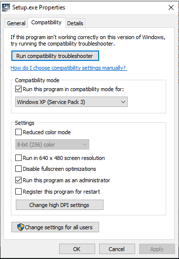
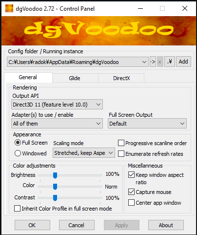
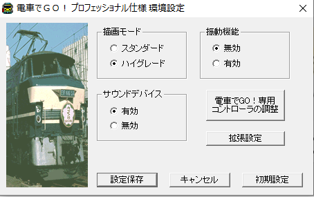

# DenshaDeGo
Notes for running the Densha de go games on Windows 10.  

Japanese guide I based this on: http://zarala.g2.xrea.com/koneta/dengo/dengo_win8.html  
Controller Mod for DdG P&P: https://github.com/GMMan/dengo-plug-and-play-controller  
dgVoodoo2 http://dege.freeweb.hu/dgVoodoo2/dgVoodoo2/  
DdG Discord: https://discord.me/denshadegounofficial  

#### General:  
I set my Windows 10 regional options to Japan to work around potential issues with installers and just left it that way because I don't mind.  
The following compatibility options were used for installing if not stated otherwise:  
  

#### dgVoodoo2 config used for all games that need it:
  
To activate dgVoodoo2 copy the following .dll files from the directory dgVoodoo2_72\MS\x86\ into the folder where the .exe file of the game is located:  
* D3D8.dll
* D3DImm.dll
* DDraw.dll

####  __Densha de Go! 2__
* dgVoodoo2 needed: Yes - otherwise the game does not run fullscreen and the bottom part of the game is not shown.
* Works with "Controller modded DdG P&P?: No
* Standard installation path: c:\Program Files (x86)\UNBALANCE\V_dengo2\  

## Densha de Go! Professional

* dgVoodoo2 needed: Yes - otherwise some HUD elements will flicker or fonts will behave strangely in high quality mode. Ignore error on game close.
Works with "Controller modded DdG P&P?: No
* Standard installation path: c:\Program Files (x86)\TAITO\DengoP\
* Game Settings:  
  
High quality mode (top left)  

* Advanced game settings:  
  
Be sure not to enable the right option as it makes the text to look weird.  

## Densha de Go! Professional 2
dgVoodoo2 needed: No
Works with "Controller modded DdG P&P?: Yes
Settings for installation:
<pic>
Settings for the game:
<pic>
