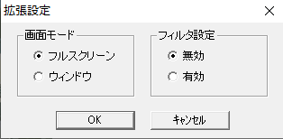
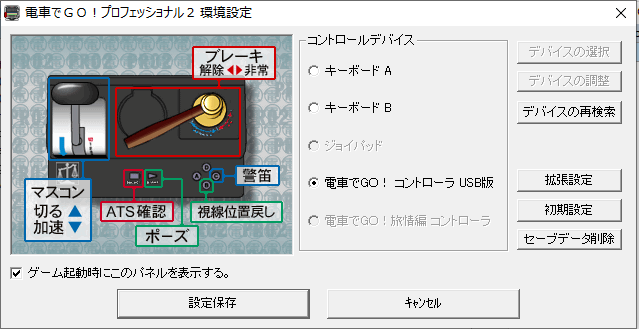
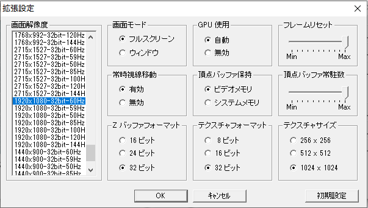
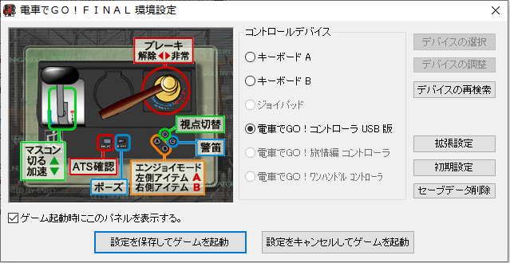

# DenshaDeGo
Notes for running the Densha de go games on Windows 10.  

Japanese guide I used: http://zarala.g2.xrea.com/koneta/dengo/dengo_win8.html  
Controller mod for DdG P&P: https://github.com/GMMan/dengo-plug-and-play-controller  
dgVoodoo2 http://dege.freeweb.hu/dgVoodoo2/dgVoodoo2/  
DdG Discord: https://discord.me/denshadegounofficial  
Controller documentation: https://marcriera.github.io/ddgo-controller-docs/  
#### General:  
I set my Windows 10 regional options to Japan to work around potential issues with installers and just left it that way because I don't mind.  
The following compatibility options were used for installing if not stated otherwise:  
  

#### dgVoodoo2 config used for all games that need it:
  
To activate dgVoodoo2 copy the following .dll files from the directory dgVoodoo2_72\MS\x86\ into the folder where the .exe file of the game is located:  
* D3D8.dll
* D3DImm.dll
* DDraw.dll

###  __Densha de Go!__
* dgVoodoo2 needed: Yes - otherwise the game does not run fullscreen and the bottom part of the game is not shown.
* Works with controller modded DdG P&P?: No
* Standard installation path: c:\Program Files (x86)\UNBALANCE\V_dengo2\  

###  __Densha de Go! 2__
* dgVoodoo2 needed: Yes - otherwise the game does not run fullscreen and the bottom part of the game is not shown.
* Works with controller modded DdG P&P?: No
* Standard installation path: c:\Program Files (x86)\UNBALANCE\V_dengo2\  

### __Densha de Go! Professional__
* dgVoodoo2 needed: Yes - otherwise some HUD elements will flicker or fonts will behave strangely in high quality mode.  
Ignore the error when closing the game.
* Works with controller modded DdG P&P?: No
* Standard installation path: c:\Program Files (x86)\TAITO\DengoP\
* Game Settings:  
  
High quality mode (top left)  
* Advanced game settings:  
  
Be sure not to enable the right option as it makes the text to look weird.  

### __Densha de Go! Professional 2__
* dgVoodoo2 needed: No
* Works with controller modded DdG P&P?: Yes
* Standard installation path: c:\Program Files (x86)\TAITO\dgopro2\
* Game Settings:  
  
* Advanced game settings:  
  

### __Densha de Go! Final__
* dgVoodoo2 needed: No
* Works with controller modded DdG P&P?: Yes
* No compatibility settings needed for installation
* Standard installation path: c:\Program Files (x86)\TAITO\perfect\
* To enable 60fps add the following key to your registry:  
Path: HKEY_CURRENT_USER\SOFTWARE\TAITO\電車でＧＯ！ＦＩＮＡＬ  
Key type: DWORD (32-bit)  
Key name: frameskip  
Key value: 0  
* To enable a fps counter add the following key to your registry:  
Path: HKEY_CURRENT_USER\SOFTWARE\TAITO\電車でＧＯ！ＦＩＮＡＬ  
Key type: DWORD (32-bit)  
Key name: showframe  
Key value: 1  
Set key value to 0 or delete it to disable the counter again.  
* Game Settings:  
  
* Advanced game settings:  
  
